# Learning Science Semantic Atlas — Base-Model Report

## Main result

- Both base models show clear **declarative knowledge** of learning-science concepts.
- Neither reliably prefers the artifact that **enacts** the target strategy.
- Per-concept activation plots below are exploratory: each concept has only **5 held-out rows per model**.
- The old RL comparison is intentionally excluded; it should be rerun with a reward that explicitly maps to the ontology.

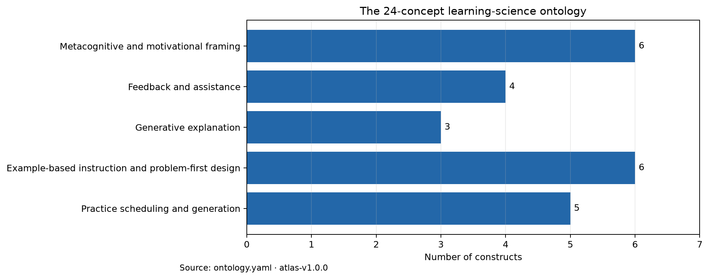

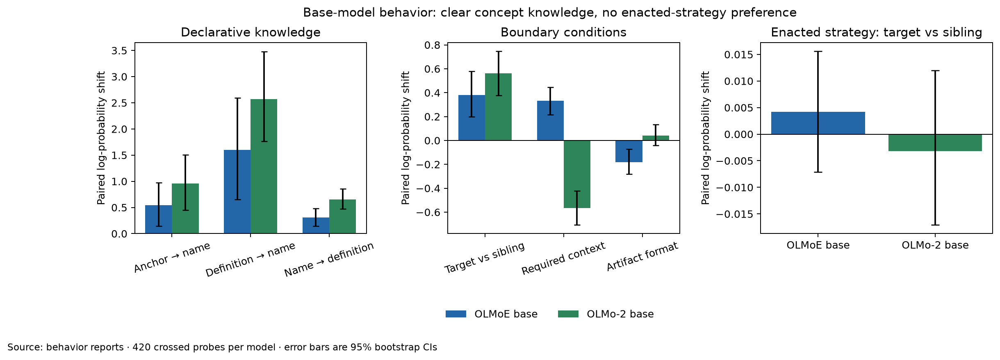

## How to read each concept plot

- **Activation:** a linear classifier predicts the concept from the model's hidden-state activation vector.
- **Control:** the best classifier that sees only shortcuts—words, length/formatting, token counts, or token identity—and never sees hidden states.
- **What matters:** `activation accuracy − control accuracy`. Example: `83% − 58% = +25` percentage points of possible internal signal beyond the measured shortcuts.
- **Chance:** 50%. Above chance alone is insufficient; activation should also beat control.
- **Error bars:** approximate 95% Wilson intervals using `n=5`. They visualize the severe uncertainty; balanced accuracy is not exactly binomial, so do not treat them as precise inferential intervals.
- With 5 test rows, each concept result is directional—not a standalone discovery.

## The 24 concepts

## Practice scheduling and generation

### Retrieval practice opportunity

- **Meaning:** The artifact requires the learner to produce target content from memory while that content is not visible or recoverable from the artifact itself. The defining feature is the withheld answer plus a required production, not the presence of a question mark.
- **Evidence grade:** `A`
- **Base-model read:** Only OLMo-2 beat its strongest measured control. Directional selectivity: OLMoE `-8.3` pp; OLMo-2 `+8.3` pp.

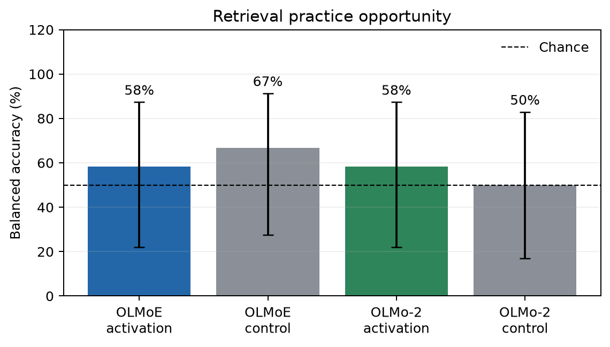

### Spaced practice schedule

- **Meaning:** The artifact assigns encounters with the same target to occasions separated in time, with a separation that is nonzero relative to the intended retention interval. Distribution across sessions is the feature; repetition within one sitting is not.
- **Evidence grade:** `A`
- **Base-model read:** Only OLMoE beat its strongest measured control. Directional selectivity: OLMoE `+8.3` pp; OLMo-2 `+0.0` pp.

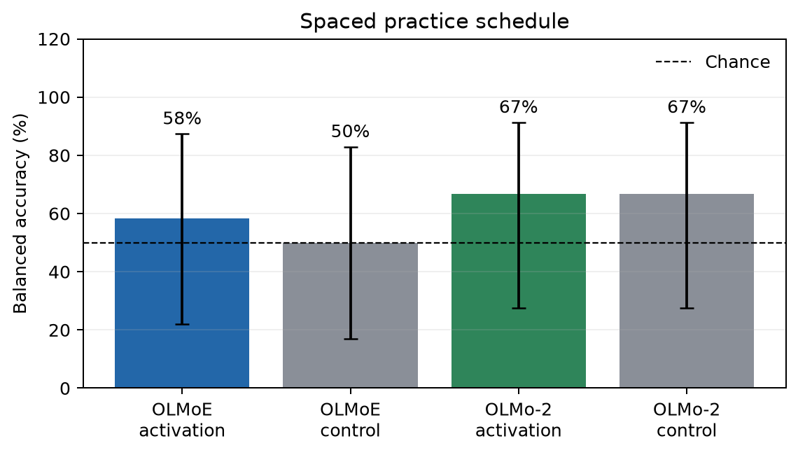

### Successive relearning to criterion

- **Meaning:** The artifact requires the learner to retrieve each target to a stated correctness criterion, and to repeat that criterion-based retrieval in later separated sessions. It is the conjunction of retrieval, a criterion, and spacing, and it is scored only when all three are specified.
- **Evidence grade:** `B`
- **Base-model read:** Neither base model beat its strongest measured control. Directional selectivity: OLMoE `+0.0` pp; OLMo-2 `-25.0` pp.

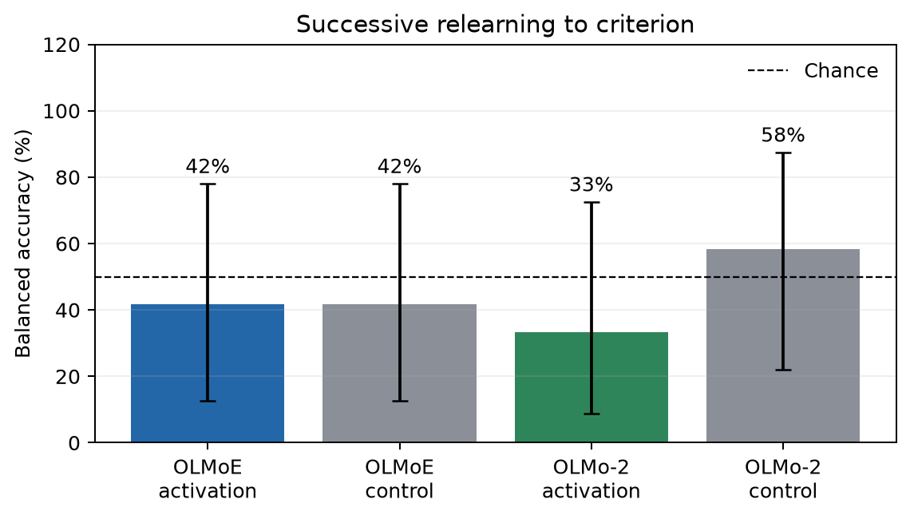

### Interleaved discrimination practice

- **Meaning:** Practice items from confusable categories are mixed so that the learner must identify which category or procedure applies before applying it. The required act is discrimination; mere topical variety is not the construct.
- **Evidence grade:** `B`
- **Base-model read:** Both base models beat their strongest measured control. Directional selectivity: OLMoE `+25.0` pp; OLMo-2 `+16.7` pp.

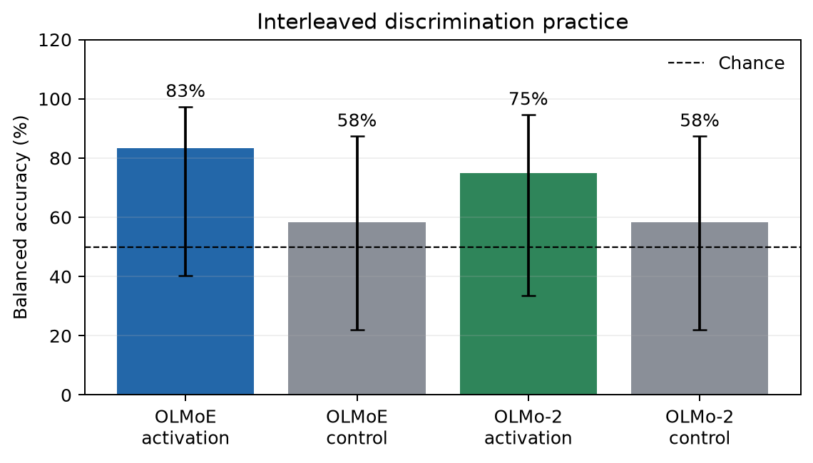

### Pretest or prequestion before instruction

- **Meaning:** The artifact requires an attempt at target content BEFORE the content is presented, with the attempt expected to fail, followed by the instruction that resolves it. Position relative to instruction is definitional.
- **Evidence grade:** `B`
- **Base-model read:** Neither base model beat its strongest measured control. Directional selectivity: OLMoE `+0.0` pp; OLMo-2 `-8.3` pp.

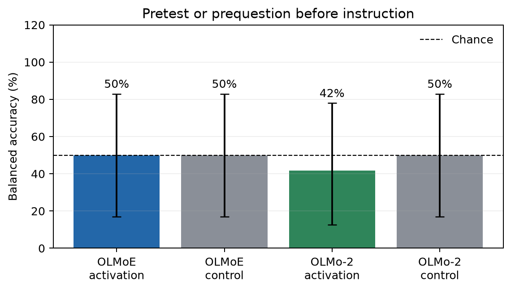

## Example-based instruction and problem-first design

### Worked example provision

- **Meaning:** The artifact supplies a complete solution to a problem of the target type, with the intermediate steps shown, for the learner to study rather than to produce.
- **Evidence grade:** `A`
- **Base-model read:** Only OLMo-2 beat its strongest measured control. Directional selectivity: OLMoE `+0.0` pp; OLMo-2 `+33.3` pp.

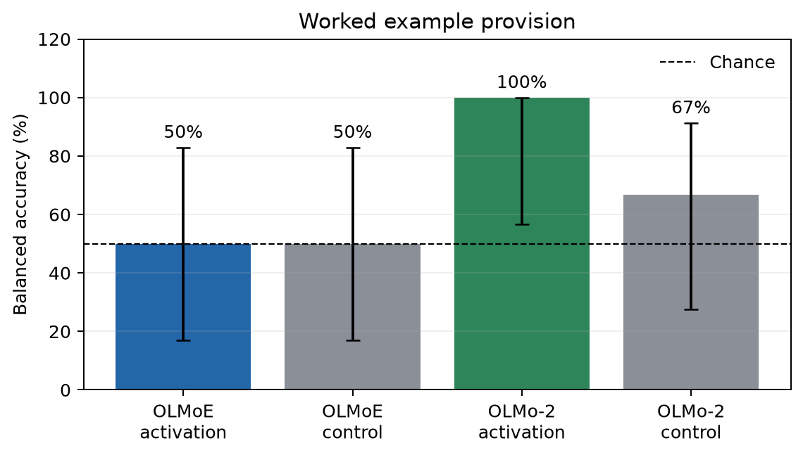

### Completion problem

- **Meaning:** A partially worked solution with one or more specified steps left blank for the learner to supply. The solved portion carries the structure; the blank carries the learner's work.
- **Evidence grade:** `B`
- **Base-model read:** Neither base model beat its strongest measured control. Directional selectivity: OLMoE `-41.7` pp; OLMo-2 `-16.7` pp.

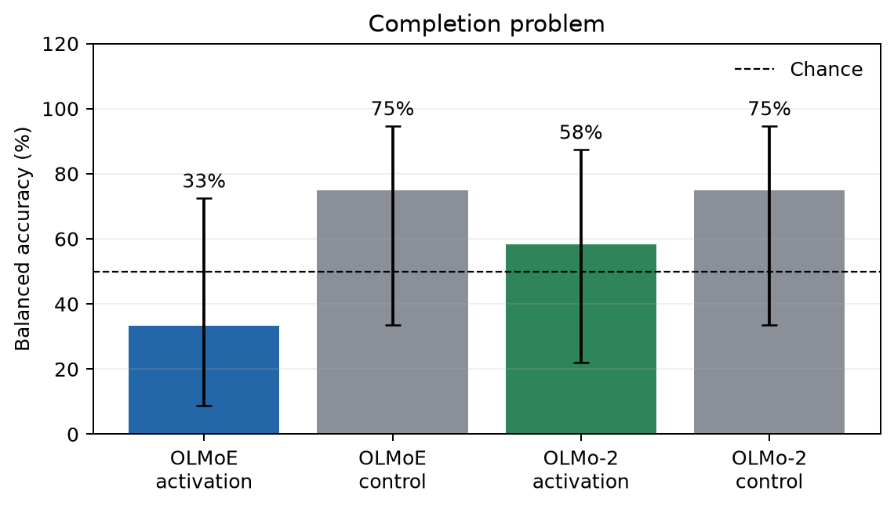

### Guidance fading across a sequence

- **Meaning:** Across an ordered sequence, the proportion of the solution supplied decreases and the proportion the learner produces increases, in a direction that is monotone or contingent on demonstrated success.
- **Evidence grade:** `B`
- **Base-model read:** Both base models beat their strongest measured control. Directional selectivity: OLMoE `+8.3` pp; OLMo-2 `+16.7` pp.

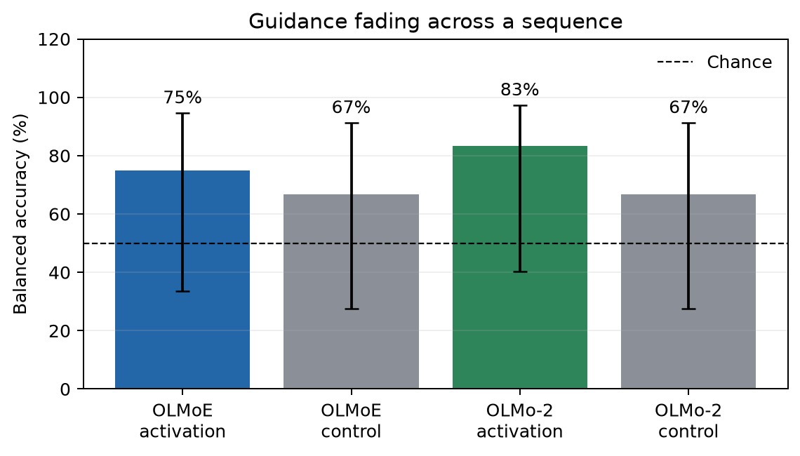

### Subgoal-labeled solution structure

- **Meaning:** The solution is segmented into named functional chunks that state what each group of steps ACCOMPLISHES, rather than only what it does procedurally. The label names a purpose, not an operation.
- **Evidence grade:** `B`
- **Base-model read:** Neither base model beat its strongest measured control. Directional selectivity: OLMoE `-8.3` pp; OLMo-2 `-16.7` pp.

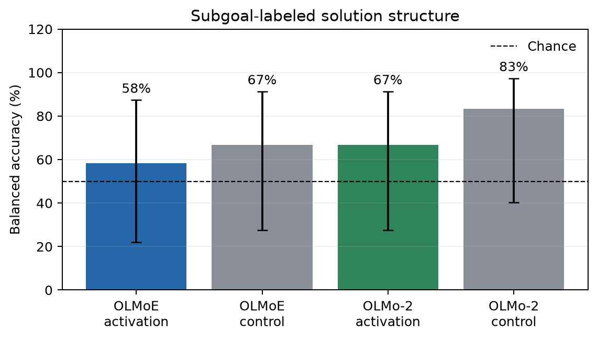

### Analogical case comparison

- **Meaning:** Two or more cases are presented together with an explicit invitation to align them and identify shared structure. Simultaneous availability plus a comparison demand are both required.
- **Evidence grade:** `B`
- **Base-model read:** Only OLMo-2 beat its strongest measured control. Directional selectivity: OLMoE `+0.0` pp; OLMo-2 `+16.7` pp.

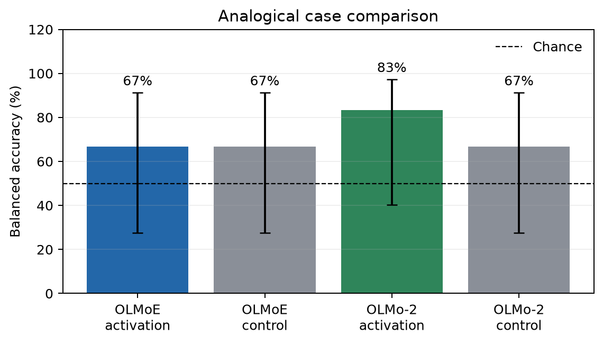

### Problem solving before instruction

- **Meaning:** The learner is asked to attempt a problem targeting a concept they have not been taught, and the canonical instruction that follows builds on the learner's own attempted solutions.
- **Evidence grade:** `C`
- **Base-model read:** Only OLMo-2 beat its strongest measured control. Directional selectivity: OLMoE `-16.7` pp; OLMo-2 `+16.7` pp.

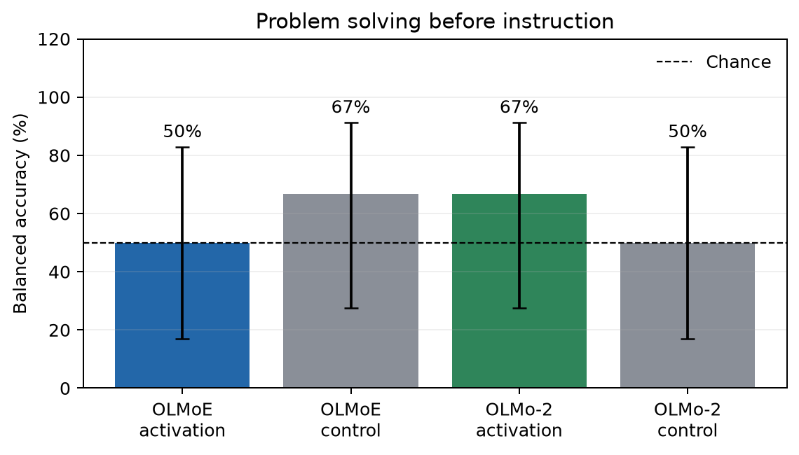

## Generative explanation

### Self-explanation prompt

- **Meaning:** The artifact requires the learner to generate an explanation of material currently available to them, beyond what the material states: why a step is valid, how a principle applies, or what connects two ideas.
- **Evidence grade:** `B`
- **Base-model read:** Neither base model beat its strongest measured control. Directional selectivity: OLMoE `-66.7` pp; OLMo-2 `-16.7` pp.

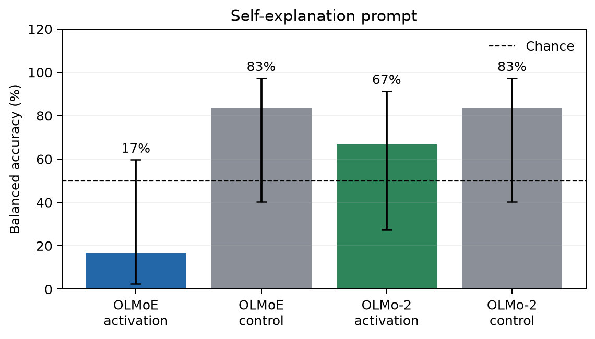

### Teach-back elicitation

- **Meaning:** The artifact requires the learner to produce an explanation addressed to another audience, real or stipulated, under an expectation of teaching. The audience orientation is what separates it from self-explanation.
- **Evidence grade:** `B`
- **Base-model read:** Neither base model beat its strongest measured control. Directional selectivity: OLMoE `-16.7` pp; OLMo-2 `-16.7` pp.

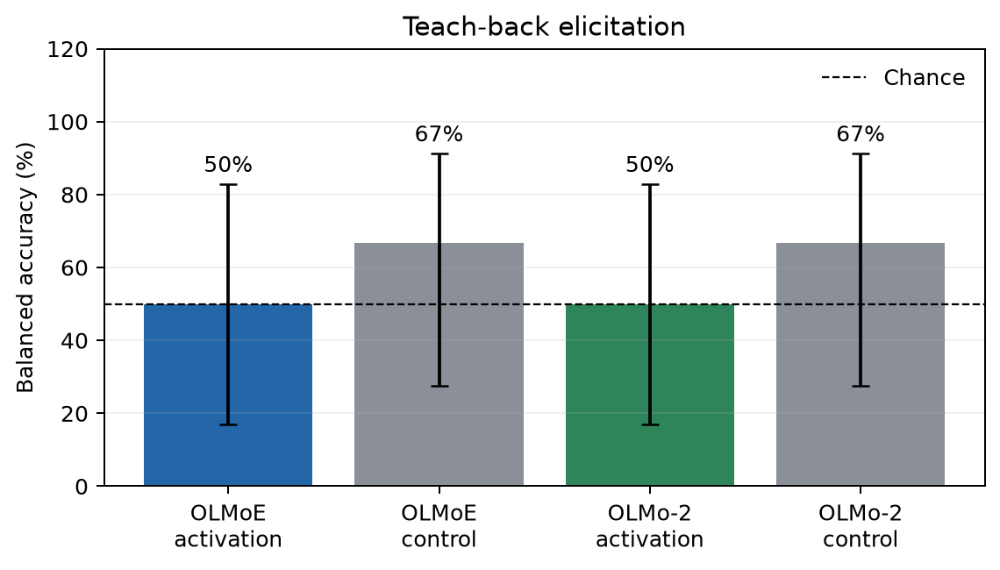

### ICAP class of the requested activity

- **Meaning:** Classification of the activity the artifact REQUESTS into passive, active, constructive, or interactive. A category label on the request, reported as a category and never averaged as an interval scale.
- **Evidence grade:** `B`
- **Base-model read:** Only OLMoE beat its strongest measured control. Directional selectivity: OLMoE `+16.7` pp; OLMo-2 `-16.7` pp.

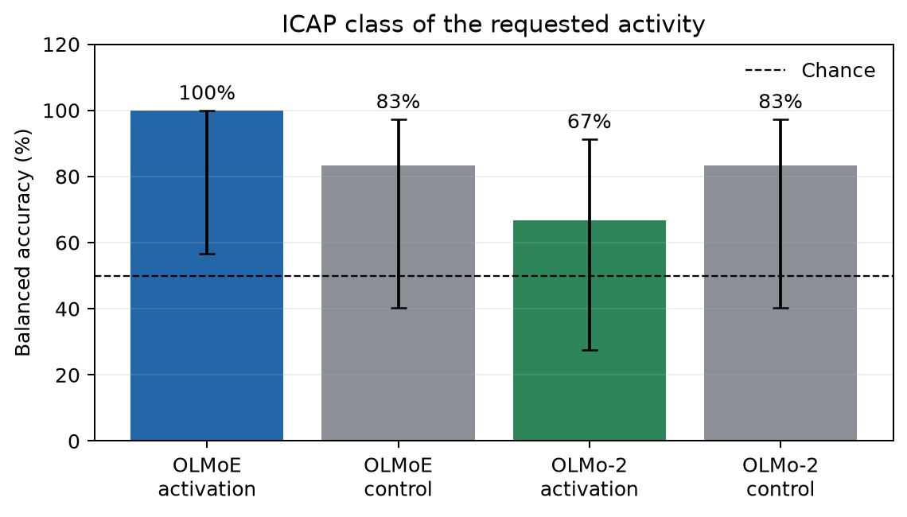

## Feedback and assistance

### Elaborated feedback specificity

- **Meaning:** Feedback that goes beyond a verdict to identify the specific element of the learner's work that departs from the reference, and why. Scored on what the feedback CONTAINS, checked against a supplied reference solution.
- **Evidence grade:** `A`
- **Base-model read:** Neither base model beat its strongest measured control. Directional selectivity: OLMoE `+0.0` pp; OLMo-2 `+0.0` pp.

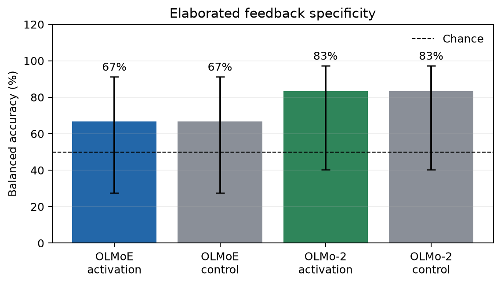

### Answer withholding level

- **Meaning:** How much of the learner's remaining work the artifact performs for them, on an ordinal scale from withholding entirely to supplying the answer. Deliberately independent of whether the supplied content is correct.
- **Evidence grade:** `B`
- **Base-model read:** Neither base model beat its strongest measured control. Directional selectivity: OLMoE `-50.0` pp; OLMo-2 `-33.3` pp.

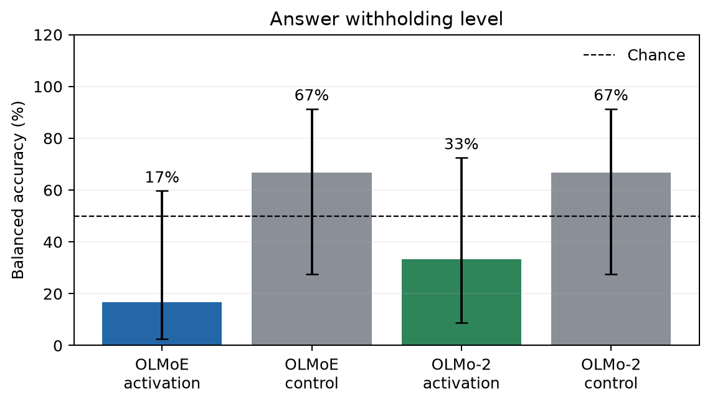

### Contingent help calibration

- **Meaning:** Whether the amount and form of help match what the learner has just demonstrated. Scored as a match against a scenario-prescribed target level, not as a preference for less help.
- **Evidence grade:** `B`
- **Base-model read:** Neither base model beat its strongest measured control. Directional selectivity: OLMoE `-25.0` pp; OLMo-2 `-25.0` pp.

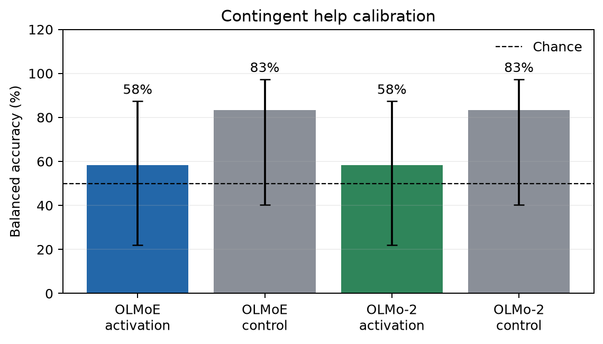

### Expertise-reversal adaptation

- **Meaning:** Whether the artifact's guidance level is adapted to the learner's stated prior knowledge in the direction the evidence requires: heavy guidance for novices, reduced guidance for the more expert.
- **Evidence grade:** `B`
- **Base-model read:** Only OLMoE beat its strongest measured control. Directional selectivity: OLMoE `+16.7` pp; OLMo-2 `-8.3` pp.

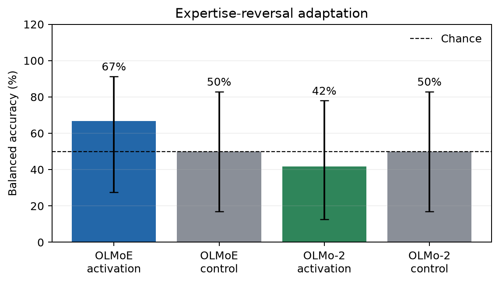

## Metacognitive and motivational framing

### Metacognitive regulation prompt

- **Meaning:** The artifact requires the learner to plan, monitor, or evaluate their own cognition about a NAMED task object: select a strategy and say why, check a specific intermediate result, or judge which part is not yet understood.
- **Evidence grade:** `B`
- **Base-model read:** Neither base model beat its strongest measured control. Directional selectivity: OLMoE `+0.0` pp; OLMo-2 `-16.7` pp.

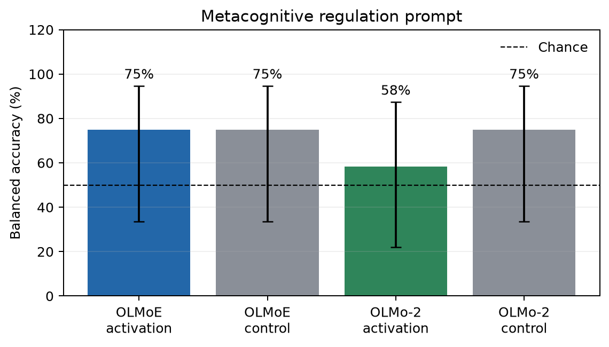

### Confidence calibration elicitation

- **Meaning:** The artifact elicits a confidence or learning judgment BEFORE the correct answer is revealed, in a form that can later be compared against measured accuracy.
- **Evidence grade:** `B`
- **Base-model read:** Neither base model beat its strongest measured control. Directional selectivity: OLMoE `-8.3` pp; OLMo-2 `-8.3` pp.

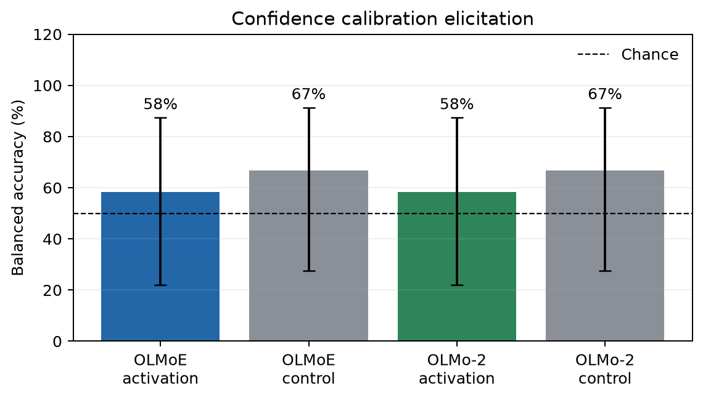

### Attributional feedback framing

- **Meaning:** Whether the artifact attributes the learner's outcome to a controllable, changeable cause (strategy choice, specific effort directed at a named step) rather than to a stable personal trait, in either direction.
- **Evidence grade:** `D`
- **Base-model read:** Neither base model beat its strongest measured control. Directional selectivity: OLMoE `+0.0` pp; OLMo-2 `-8.3` pp.

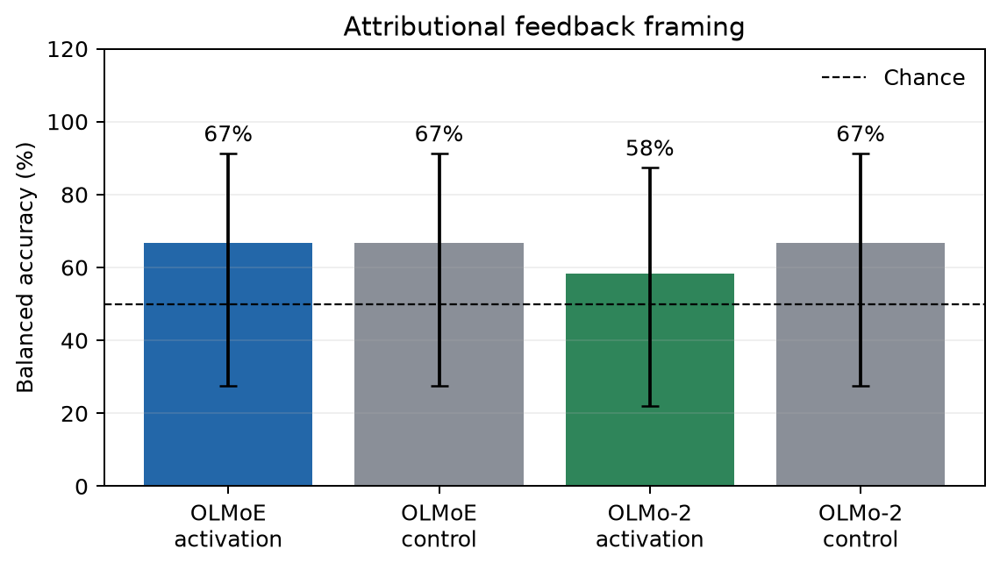

### Utility-value relevance prompt

- **Meaning:** The artifact requires the LEARNER to generate a connection between the material and their own life, goals, or interests. Learner generation is definitional; an instructor-asserted application is a different thing.
- **Evidence grade:** `C`
- **Base-model read:** Only OLMo-2 beat its strongest measured control. Directional selectivity: OLMoE `+0.0` pp; OLMo-2 `+33.3` pp.

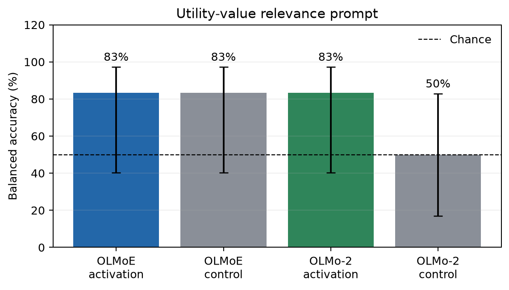

### Autonomy-supportive framing

- **Meaning:** The artifact provides meaningful rationale for a request, offers bounded choice, uses informational rather than controlling language, or acknowledges the learner's perspective, in place of directives and pressure.
- **Evidence grade:** `B`
- **Base-model read:** Only OLMo-2 beat its strongest measured control. Directional selectivity: OLMoE `+0.0` pp; OLMo-2 `+25.0` pp.

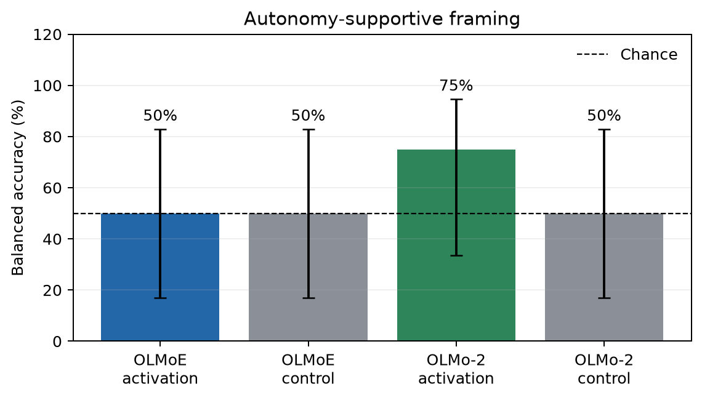

### Belonging-affirmation framing

- **Meaning:** Framing that normalizes difficulty as a common, temporary part of the transition rather than as evidence that this learner does not belong, typically by attributing struggle to the situation and its timeline.
- **Evidence grade:** `C`
- **Base-model read:** Neither base model beat its strongest measured control. Directional selectivity: OLMoE `-41.7` pp; OLMo-2 `-58.3` pp.

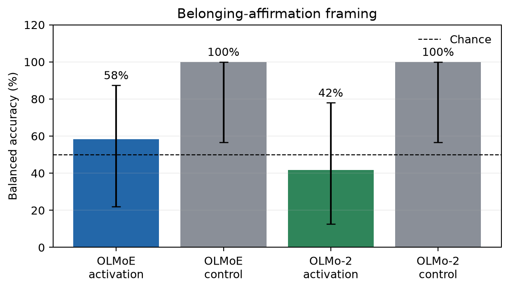

## Bottom line

- Strongest shared above-control directions: interleaved discrimination and guidance fading.
- Many concepts are matched or beaten by surface/token controls.
- These plots measure linear decodability—not causal use, learner uptake, or learning outcomes.
- Next RL experiment: map every rewarded dimension to explicit ontology constructs and evaluate held-out constructs separately.

## Reproducibility

- Source reports: `results/remote/`
- Plot/report generator: `plot_report.py`
- Verification: `339` project tests passed; Ruff clean.
